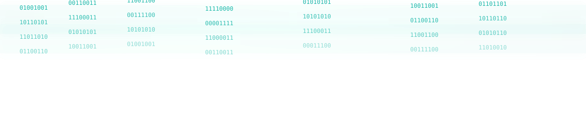

<!-- Kush Amit Shah | Cybersecurity Portfolio README -->
<!-- Modern Light Glassmorphism • Parallax 3D Style • Cybersecurity Branding -->

<!-- Main Banner -->

<!-- Subtle Matrix Glass Banner -->

---

### About Me
> I am **Kush Amit Shah**, a **Cybersecurity Enthusiast**, **Web Developer**, and **Software Tester** committed to building secure, scalable, and ethical digital systems for a safer cyberspace.

**Education**
- B.Tech in Computer Engineering — CSPIT Changa  
- Diploma in Computer Engineering — Bhailalbhai & Bhikhabhai Institute of Technology  

**Portfolio:** [www.kushshahofficial.netlify.app](https://www.kushshahofficial.netlify.app)

---

### Technical Stack

 

---

### Major Projects

| Project | Description | Tech Stack |
|----------|--------------|-------------|
| **AES-AdvanceEncryptionStandard-UsingC** | Secure AES encryption-decryption algorithm in C++. | C++ |
| **Flat-Maintenance-System** | Web-based maintenance tracking & automated payment system. | PHP, MySQL |
| **ICICI-Bank-Clone-Enhanced-UI** | Secure online banking system clone with modern UI. | Node.js, HTML, CSS |
| **EcoGuardians-Official_NGO-Website** | Responsive NGO website promoting environmental awareness. | HTML, CSS, JavaScript |

---

### GitHub Analytics

 

---

### Contribution Snake

  

---

### Connect With Me

---

### Certifications & Achievements

---

### Quote

<h2 style="color:#00AFA0;text-shadow:0 0 20px #00AFA0,0 0 40px #00AFA0;">
“Cybersecurity is not just an IT topic, it's a national shield.”
</h2>

---

Designed & Maintained by <strong>Kush Amit Shah</strong> 
Decrypting the World... One Line of Code at a Time.

