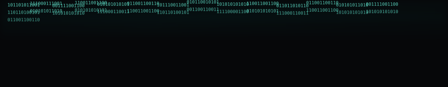

<!-- README.md
     Kush Amit Shah — Professional Dark • Glassmorphism • Continuous Motion
     Place asset files under /assets and push. Mobile compatible.
-->

<!-- Header animation (local SVG) -->

<!-- Dark matrix banner -->

### About
I am **Kush Amit Shah**. Cybersecurity professional focus. Web developer and software tester. I build secure, maintainable systems.

**Education**
- B.Tech in Computer Engineering — CSPIT Changa  
- Diploma in Computer Engineering — Bhailalbhai & Bhikhabhai Institute of Technology

**Portfolio:** https://www.kushshahofficial.netlify.app

### Technical Stack

<!-- official simpleicons CDN for reliable rendering -->

 

### Projects

### GitHub Stats (light-compatible, dark style)

### Contribution Snake

  

### Certifications

### Contact

<!-- quote neon SVG -->

  <img src="assets/quote-ne